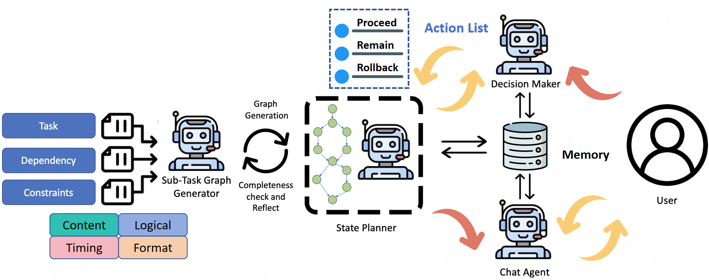

# MyGO: Mapping Your Goals with Multi-Agent for Predefined Task-Oriented Dialogue in LLMs

Traditional task-oriented dialogue (TOD) systems primarily focus on addressing tasks initiated by users, often overlooking scenarios where the system itself predefines tasks to be completed through dialogue. In such system-predefined task settings, dialogues can easily deviate from the intended complex task objectives, leading to inefficiencies. To address these limitations, we propose MyGO, a novel multi-agent system for TODs. Our approach leverages a sub-task graph to guide dialogue generation, integrating multiple specialized agents for a dynamic and iterative dialogue process. By decomposing system-defined objectives into structured workflows, MyGO ensures alignment with task objectives by continuously updating the task state and adapting to user inputs. Through experimental results, MyGO demonstrates superior performance across various evaluation metrics, showcasing its ability to manage complex tasks with precision and coherence while maintaining focus on task objectives. MyGO paves a new direction for conversational AI and lays a solid foundation for future advancements in multi-agent dialogue systems.
We present PPTAgent, an innovative system that automatically generates presentations from documents. Drawing inspiration from human presentation creation methods, our system employs a two-step process to ensure excellence in overall quality. Additionally, we introduce **PPTEval**, a comprehensive evaluation framework that assesses presentations across multiple dimensions.

## Contributions

- We propose the MyGO multi-agent system, which substantially enhances dialogue management by effectively integrating agents such as the Sub-Task Dependency Graph Generator, State Planner, Chat Agent, and Decision Maker. By leveraging these components, MyGO provides a robust framework for managing TODs.
- We introduce a novel approach to structured complex task decomposition by constructing tasks as a graph using three types of dependencies and four constraint dimensions. This structure allows for a more organized and efficient management of dialogue processes, ensuring that complex instructions are decomposed and dependencies are clearly represented.
- We propose comprehensive evaluation criteria along with a diverse dataset across 14 domains specifically designed for predefined TODs. This set of criteria encompasses multiple dimensions such as Success Rate, Response Relevance, Sub-Task Transition Accuracy, Adherence to Dialogue Flow, and Topic Boundary Control. It provides a thorough assessment of dialogue quality, offering detailed insights that guide improvements in managing TODs effectively.
- MyGO demonstrates its effectiveness in TOD management through benchmark comparisons and detailed ablation studies. MyGO exhibits superior performance across various evaluation metrics, showcasing its ability to handle complex tasks with precision and coherence while maintaining focus on task objectives. Overall, MyGO sets a robust foundation for future advancements in multi-agent dialogue systems.

## MyGO 🤖

The system is structured around four main agents: the Sub-Task Dependency Graph Generator, State Planner, Chat Agent and Decision Maker. The Sub-Task Dependency Graph Generator constructs the task as a graph, utilizing three types of dependencies and four constraint dimensions to accurately map out the task's structure. This graph serves as the foundational blueprint for task execution. The State Planner is responsible for maintaining the task's state, using the sub-task graph to track progression and guide transitions. The Chat Agent generates responses based on the current sub-task and user input, ensuring smooth communication and task progression. The Decision Maker evaluates the dialogue history, determining whether to remain at the current node or transition to an adjacent one. This decision is guided by the planner and the structure of the DAG, ensuring logical and efficient task execution. An overview of our framework is illustrated below:

## Sub-Task Dependency Graph Generator ⚖️

The Sub-Task Dependency Graph Generator transforms complex tasks into structured sub-task graphs through three-phase processing: task decomposition, dependency modeling, and constraint integration.

The workflow of Sub-Task Dependency Graph Generator is shown below:

